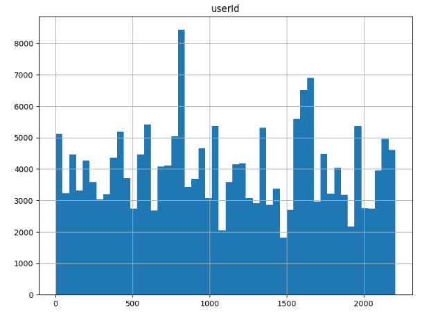
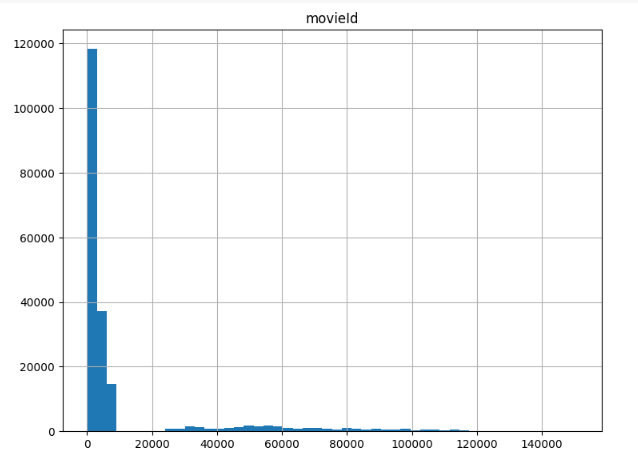
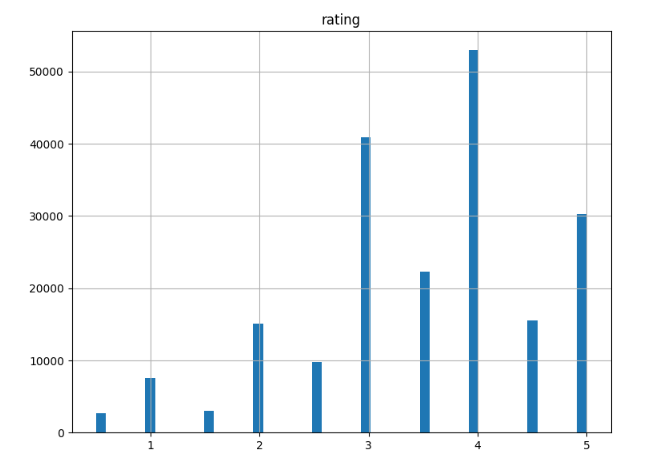

# Laporan Proyek Machine Learning - Imam Mulyana

## Project Overview : Recomendation Movie

Dalam penerapan Content-Based Filtering pada dataset movies_recomendation_system, variabel seperti `userId` yang berguna mencatat id penonton, `movieId` yang berguna mencatat id dari film, `rating`yang berguna mencatat hasil rating yang diperoleh, `timestamp` yang digunakan mencatat waktu tonton, `title` yang berguna mencatat nama film, dan `genres`yang berguna mencatat genre film menjadi kunci dalam memberikan rekomendasi film yang personal. Dengan memanfaatkan informasi judul atau title dan genre sebagai fitur utama, model dapat mengekstraksi karakteristik unik dari setiap film. Adapun informasi lain seperti timestamp (waktu tonton) tidak digunakan model karena hanya akan menggunakan fitur utama yaitu title dan genre, sementara perhitungan kesamaan menggunakan metrik seperti cosine similarity memungkinkan penentuan sejauh mana suatu film cocok dengan preferensi individu. Melalui pendekatan ini, diharapkan sistem dapat memberikan rekomendasi film yang lebih relevan dan sesuai dengan selera pengguna [[1]](https://patents.google.com/patent/US10546326B2/en), meningkatkan pengalaman hiburan mereka.

Proyek implementasi Content-Based Filtering pada dataset movies_recomendation_system memiliki signifikansi yang tinggi karena berkontribusi pada peningkatan pengalaman pengguna dalam menemukan dan menilai film sesuai dengan preferensi pribadi mereka [[2]](https://patents.google.com/patent/US10616650B2/en). Dalam industri hiburan yang kaya akan variasi film, sistem rekomendasi yang efektif memainkan peran krusial dalam mengatasi masalah kelebihan informasi. Dengan memanfaatkan informasi judul dan genre, proyek ini memberikan solusi untuk mempersempit pilihan film yang sesuai dengan preferensi individu, sehingga memudahkan pengguna dalam menemukan konten hiburan yang mereka nikmati. Kesuksesan proyek ini dapat meningkatkan kepuasan pengguna, membantu platform streaming atau penyedia konten untuk mempertahankan dan menarik audiens, serta meningkatkan efektivitas dalam menyajikan rekomendasi yang relevan. Oleh karena itu, penyelesaian proyek ini memiliki dampak positif terhadap pengguna dan industri hiburan secara keseluruhan.

## Business Understanding

Dalam industri hiburan yang dinamis, terdapat tantangan besar bagi pengguna untuk menavigasi melalui ribuan judul film yang tersedia dan menemukan konten yang sesuai dengan preferensi pribadi mereka. Oleh karena itu, proyek Content-Based Filtering movies_recomendation_system bertujuan untuk memecahkan masalah ini dengan memberikan rekomendasi film yang disesuaikan dengan karakteristik dan selera pengguna. Tujuan bisnisnya adalah meningkatkan tingkat kepuasan pengguna di platform hiburan yang digunakan dan menciptakan pengalaman menonton yang lebih personal. Dengan menyajikan rekomendasi film yang relevan berdasarkan informasi judul dan genre, proyek ini diharapkan dapat membangun loyalitas pelanggan dan meningkatkan interaksi pelanggan dengan platform.

### Problem Statements

Menjelaskan pernyataan masalah:

- Berdasarkan data mengenai pengguna, bagaimana membuat sistem rekomendasi yang dipersonalisasi dengan teknik content-based filtering?
- Dalam teknik content-based filtering, bagaimana cara menetukan kemiripannya?
- Apa parameter keberhasilan dalam pembuatan sistem rekomendasi dengan teknik content-based filtering ini

### Goals

Menjelaskan tujuan proyek yang menjawab pernyataan masalah:

- Menghasilkan sejumlah rekomendasi restoran yang dipersonalisasi untuk pengguna dengan teknik content-based filtering.
- Menggunakan teknik cosine similarity untuk mengukur suatu kemiripan rekomendasi
- Menggunakan metrik evaluasi dengan capaian rekomendasi yang sesuai atau mirip adalah 80%

  ### Solution statements

- Pendekatan Content-Based Filtering Berbasis Genre dan title:

Tujuan utama adalah menghasilkan rekomendasi restoran yang dipersonalisasi dengan memanfaatkan informasi genre dan title. Menggunakan cosine similarity, model ini akan mengukur kemiripan antara restoran berdasarkan karakteristik genre dan title, dengan target mencapai atau melebihi 80% dalam metrik evaluasi.

- Pendekatan Feature Engineering pada Content-Based Filtering:

Mengembangkan pendekatan content-based filtering dengan melakukan feature engineering pada informasi userId, movieId, rating, title, dan genres. Langkah ini bertujuan untuk meningkatkan kepekaan model terhadap preferensi pengguna, dengan tujuan mencapai atau melebihi 80% dalam metrik evaluasi.

## Data Understanding

Data yang digunakan pada proyek kali ini adalah berjumlah 22.884.377 juta data, namun karena ada permasalahan komputasi maka data yang digunakan hanya 200.000 ribu data. Dataset yang digunakan berbentuk csv dan tersimpan kedalam 2 file csv, oleh karena itu selanjutnya data digabungkan atau dimerge agar mempermudah proses selanjutnya. Data tidak memiliki missing value dan terdiri penonton film: 2206, jumlah film: 11137, dan jumlah genre: 1446 semuanya didapatkan dari nilai unik masing-masing. Adapun dataset yang digunakan adalah [movies_recomendation_system](https://www.kaggle.com/datasets/kanametov/movies-recomendation-system?select=links.csv) dengan komposisi varibel `userId`, `movieId`, `rating`, `timestamp`, `title`, dan `genres`. Selanjutnya variabel yang digunakan dalam pembuatan proyek dengan model content based filtering ini terdiri dari`userId`, `movieId`, `title`, dan `genres`, namun sebelumnya untuk varibel `genres` harus displiting terlebih dahulu karena proyek ini hanya akan menggunakan satu genre dengan satu movie.

Variabel-variabelnya adalah sebagai berikut:

- `userId` = menunjukkan id para penonton film
- `movieId` = menunjukkan id dari film
- `rating` = menunjukkan rating dari film
- `timestamp` = menunjukkan waktu menonton film
- `title` = menunjukkan judul tau nama film
- `genres` = menunjukkan genre dari film

**Univariate Exploratory Data Analysis**:

- Melihat varibel-varibel dalam dataset
- Mencari nilai minimum, maksimum, dan sebaran rating
- Mencari jumlah penonton film, jumlah film, dan genre yang tersedia
- Mengetahui tipe rating
- Mengetahui 5 film yang paling banyak ditonton:

| No  | movieId | Title                            | Genre  |
| --- | ------- | -------------------------------- | ------ |
| 1   | 356     | Forrest Gump (1994)              | Comedy |
| 2   | 296     | Pulp Fiction (1994)              | Comedy |
| 3   | 593     | Silence of the Lambs, The (1991) | Crime  |
| 4   | 318     | Shawshank Redemption, The (1994) | Crime  |
| 5   | 480     | Jurassic Park (1993)             | Action |

- Melihat distribusi variabel:
- 
- Dari visualisasi data user, dapat kita lihat bahwa variasi penonton cukup tinggi. Namun ada beberapa penonton yang memiliki antusias yang tinggi terhadap menonton film
- 
- Ternyata film yang banyak ditonton adalah film yang berada pada movieId, sekitar 5.000 kebawah. Hal ini sesuai dengan 5 film yang paling banyak ditonton yang memiliki id dibawah 5.000
- 
- Dari skala rating 0 sampai 5, banyak sekali rating yang diberakan diatas 3. artinya film yang diberikan cenderung berkualitas dan bagus

## Data Preparation

Secara garis besar

- Teknik merge digunakan karena data tersimpan dalam dua file yang terpisah sehingga harus digabungkan
- Teknik splitting string digunakan karena data genre terdiri dari beberapa genre, namun karena pada proyek ini hanya akan menggunakan satu genre pada satu film maka splitting harus dilakukan pada fitur genres. Penggunaan satu film dengan satu genre dimaksudkan agar mempermudah pengkategorian sebuah film
- Rename digunakan untuk mengubah nama fitur agar lebih mudah dibaca dan dipahami
- Droping digunakan untuk menghapus fitur-fitur ataupun duplikat yang tidak diperlukan
- Mengkoversi data kedalam bentuk list agar sesuai dengan prasyarat tahap modeling seperti TfidfVectorizer dan tfidf_matrix.todense()

## Modeling

Model yang digunakan adalah content based filtering yaitu penggunaan pengelaman user sebelumnya digunakan sebagai rekomendasi film-film yang sesuai dengan film yang pernah ditonton. Model ini sangat bermanfaat bagi pengguna untuk mendapatkan preferensi pribadi yang baik. Adapun tahapan pembuatan model diawali dengan:

1. melakukan TF-IDF Vectorizer yaitu suatu metode dalam pemrosesan teks yang digunakan untuk mengubah dokumen teks menjadi vektor, sehingga dapat diolah oleh algoritma machine learning. Metode ini memberikan nilai bobot untuk setiap kata (term) dalam dokumen berdasarkan seberapa sering kata tersebut muncul dalam dokumen tersebut (TF) dan seberapa umum kata tersebut muncul di seluruh koleksi dokumen (Inverse Document Frequency or IDF). Hal ini digunakan untuk mengidentifikasi fitur penting
2. melakukan tranformasi kedalam bentuk matrix. Hal ini dilakukan untuk mempersiapkan data digunakan pada perhitungan cosine similarity
3. melakukan perhitungan cosine similarity untuk melihat sebarapa mirip antara fitur name_movie dengan genre di film lainnya
4. melakukan rekomendasi dengan mengambil satu contoh film

Pada tahap percobaan modeling ini, film Toy Story (1995) digunakan sebagai preferensi rekomendasi sehingga dihasilkan sebuah rekomendasi sebagai berikut:

| name_movie                                    | genres    |
| --------------------------------------------- | --------- |
| Madagascar 3: Europe's Most Wanted (2012)     | Adventure |
| Wild America (1997)                           | Adventure |
| Free Willy 3: The Rescue (1997)               | Adventure |
| Excess Baggage (1997)                         | Adventure |
| Largo Winch (Heir Apparent: Largo Winch, The) | Adventure |

Model dapat terus dioptimalkan atau dikembangkan lebih lanjut di masa depan dengan mempertimbangkan penambahan fitur tambahan seperti deskripsi film dan perhitungan kemiripan dengan tekknik lain seperti Jaccard Similarity, Euclidean Distance, dan Manhattan Distance

**Kelebihan Content-Based Filtering:**

1. **Personalisasi Tinggi:**

   - Content-Based Filtering dapat memberikan rekomendasi yang sangat dipersonalisasi karena model memahami preferensi pengguna berdasarkan karakteristik Content yang disukai oleh pengguna.

2. **Tidak Bergantung pada Data Eksternal:**

   - Model Content-Based tidak memerlukan data eksternal atau informasi mengenai perilaku pengguna lainnya. Hal ini membuatnya lebih mandiri dan cocok untuk situasi di mana data pengguna terbatas atau tidak tersedia.

3. **Explikabilitas Tinggi:**

   - Keputusan yang dihasilkan oleh model Content-Based lebih mudah dijelaskan karena didasarkan pada karakteristik Content yang dapat dimengerti oleh pengguna.

4. **Tahan terhadap Cold Start Problem:**
   - Content-Based Filtering cenderung lebih tahan terhadap masalah Cold Start, di mana model dapat memberikan rekomendasi bahkan untuk item baru yang belum banyak dinilai oleh pengguna.

**Kekurangan Content-Based Filtering:**

1. **Terbatas pada Diversitas:**

   - Model Content-Based cenderung membatasi variasi dan kejutan dalam rekomendasi karena hanya menggunakan informasi tentang item yang sudah dikenal oleh pengguna.

2. **Keterbatasan Representasi Fitur:**

   - Keefektifan Content-Based sangat tergantung pada representasi fitur yang digunakan. Jika fitur yang digunakan tidak cukup informatif, model mungkin kurang dapat memahami preferensi pengguna secara menyeluruh.

3. **Sensitif terhadap Kualitas Metadata:**

   - Content-Based Filtering membutuhkan metadata yang berkualitas tinggi dan akurat. Jika metadata tidak tepat atau kurang lengkap, kualitas rekomendasi dapat terpengaruh.

4. **Kesusahan dalam Menangani Interaksi Kompleks:**
   - Content-Based cenderung kurang efektif dalam menangani interaksi kompleks antar item atau preferensi yang kompleks dari pengguna karena fokusnya pada fitur-fitur individual.

## Evaluation

Metrik evaluasi adalah ukuran atau parameter yang digunakan untuk mengukur kinerja atau kualitas dari suatu sistem, model, atau algoritma. Metrik evaluasi membantu dalam mengevaluasi sejauh mana suatu model atau sistem dapat mencapai tujuan atau memberikan solusi yang baik untuk suatu masalah. Pada tahap evaluasi ini, karena tensorflow tidak menyediakan library matrik evaluasi untuk modeel content based filtering. Maka digunakan rumus manual untuk menghitung presisi dari model sebagai berikut :

$$ Precision = {of recommendation that are relevant \over of item we recommend} $$

- Precision: Mengukur sejauh mana item yang direkomendasikan oleh sistem adalah benar-benar relevan.

Cara kerja dari metrik ini adalah dengan membagi rekomendasi yang relevan dengan jumlah item rekomendasi. Dimana hasilnya sangat memuaskan, yaitu berada pada presentase 100% dari target awal adalah 80%. Sehingga bisa disimpulkan model berjalan dengan baik. Adapun presisi 80% bisa didapatkan melalui perhitungan berikut:

$$ Precision = {film yang memiliki genre sama, yaitu berjumlah 4 \over jumlah film atau genre yang masuk perhitungan rekomendasi, yaitu 5} $$
